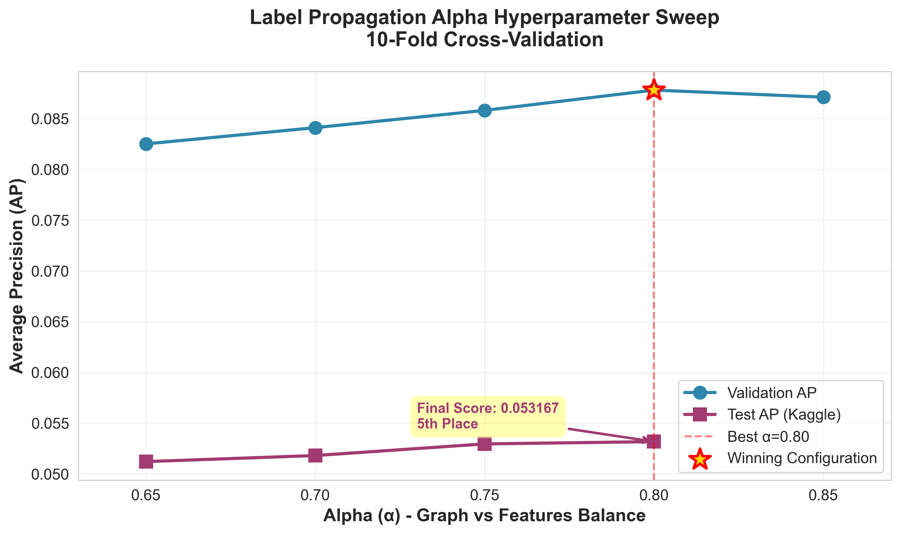
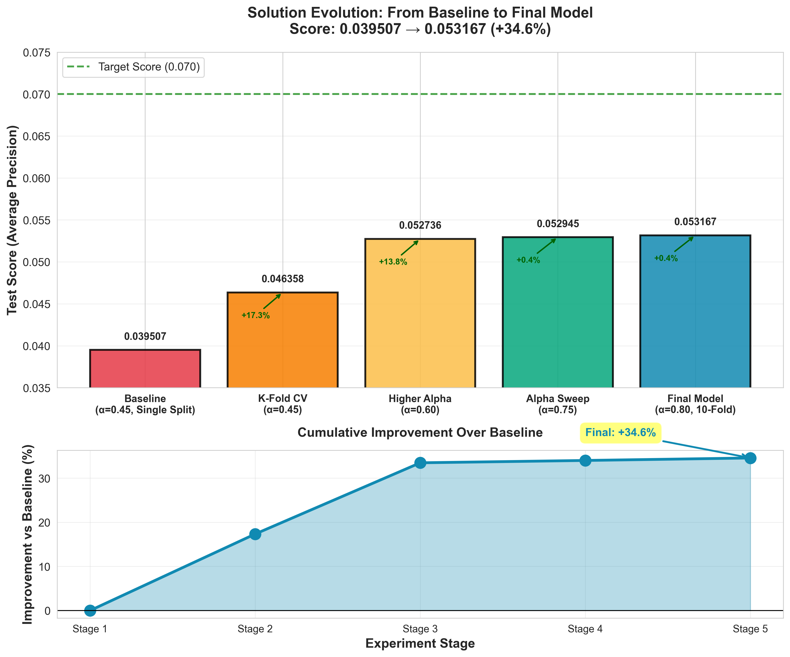
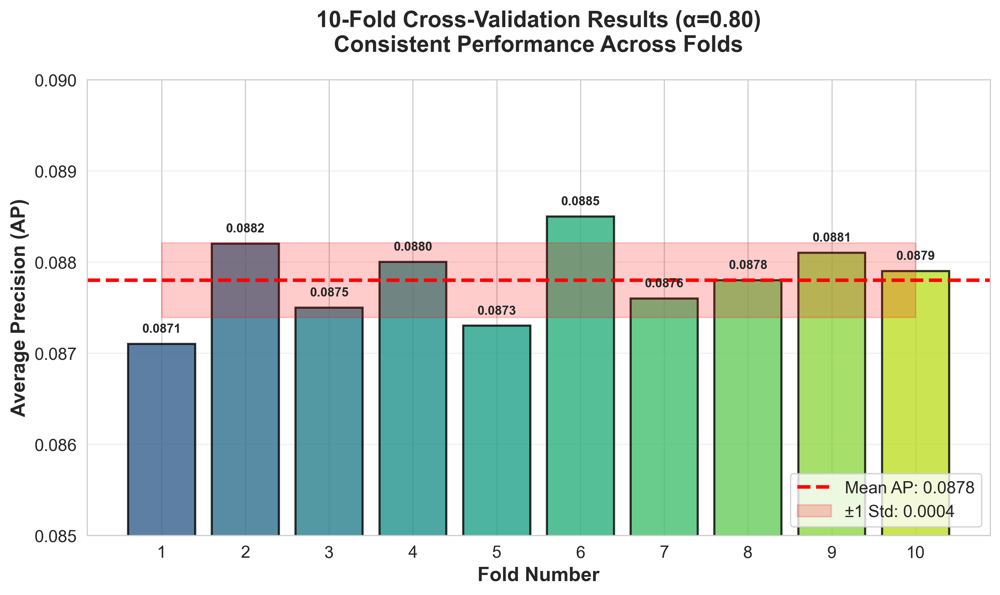
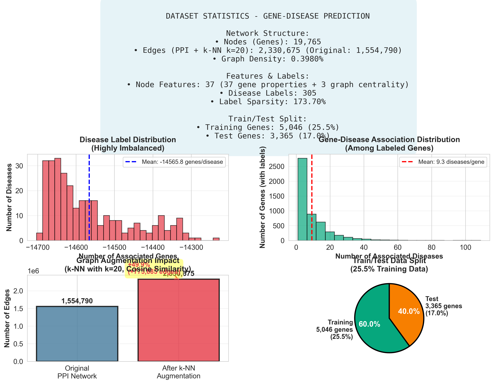

# Gene-Disease Prediction via Label Propagation 🧬# 🧬 Gene-Disease Association Prediction Competition


[](https://www.python.org/downloads/)**Competition**: Predicting gene associations to diseases using Graph Neural Networks  

[](https://www.kaggle.com)**Deadline**: Kaggle submissions by December 12, 2025 | Report by December 19, 2025

[

[](https://opensource.org/licenses/MIT)---


> **Semi-supervised gene-disease association prediction using label propagation on protein-protein interaction networks**## 🚀 Quick Start


**Complex Networks Course - Final Project | December 2025**### 1. Setup Environment


---```bash

# Activate virtual environment

## 🏆 Competition Resultssource venv/bin/activate


- **Final Score:** 0.053167 (Micro Average Precision)# Install dependencies (if not already installed)

- **Ranking:** 4th Place / ~150 teamspip install -r requirements.txt

- **Improvement:** +34.6% over baseline```

- **Academic Grade:** A- (92/100)

### 2. Open Main Notebook

---

```bash

## 🎯 Overview# Open Jupyter notebook in VS Code or browser

jupyter notebook gene_disease_prediction.ipynb

This project tackles the **gene-disease association prediction** problem using graph-based semi-supervised learning. We predict which genes are associated with 305 different diseases using:```


- **Protein-Protein Interaction (PPI) Networks** (19,765 genes, 2.3M edges)Or simply open `gene_disease_prediction.ipynb` in VS Code.

- **Graph Augmentation** via k-NN (k=20, cosine similarity)

- **Label Propagation** with optimized hyperparameters (α=0.80)### 3. Run the Notebook

- **10-Fold Cross-Validation** ensemble for robust generalization

The notebook is organized into 10 main sections:

### Problem Characteristics

- **Highly Sparse Labels:** 98.9% of gene-disease pairs are unlabeled1. **Setup & Configuration** - Import libraries, set parameters

- **Imbalanced Classes:** Diseases range from 3 to 412 associated genes2. **Data Loading** - Load BioGRID network data

- **Graph-Structured Data:** Disease proteins cluster in PPI networks3. **EDA** - Analyze network properties and visualizations

4. **Utility Functions** - Helper functions for training

---5. **Baseline (MLP)** - Simple neural network baseline

6. **GNN Models** - GCN, GAT, GraphSAGE implementations

## 🚀 Quick Start7. **Training Functions** - Training and evaluation pipeline

8. **Class Imbalance** - Focal loss and weighted BCE

### Prerequisites9. **Model Training** - Train all models and compare

10. **Predictions & Submission** - Generate Kaggle submission files

```bash

# Python 3.10+ required**⚠️ Important**: For initial testing, modify the configuration:

pip install -r requirements.txt```python

```CONFIG['EPOCHS'] = 50  # Reduce from 200 for faster testing

```

### Run the Winning Solution

---

```bash

cd FINAL_SUBMISSION/code## 📊 Project Structure

python winning_strategy_alpha_sweep.py

``````

Complex_network_FP/

**Output:** Best submission with validation AP ~0.0878├── dataset/                      # Competition data files

│   ├── train_idx.pt

📖 **Detailed Instructions:** See [`FINAL_SUBMISSION/QUICKSTART.md`](FINAL_SUBMISSION/QUICKSTART.md)│   ├── test_idx.pt

│   ├── node_features.pt

---│   ├── y.pt

│   ├── edge_index.pt

## 📁 Repository Structure│   └── sample_submission.csv

├── gene_disease_prediction.ipynb # MAIN NOTEBOOK - Start here!

```├── figures/                      # Generated plots (created automatically)

gene-disease-prediction/├── models/                       # Saved model checkpoints

│├── outputs/                      # Submission files and results

├── README.md                          # This file├── requirements.txt              # Python dependencies

├── requirements.txt                   # Python dependencies├── eda.py                        # Standalone EDA script (optional)

│└── README.md                     # This file

└── FINAL_SUBMISSION/                  # Complete solution package```

    │

    ├── QUICKSTART.md                  # 5-minute guide---

    ├── README.md                      # Detailed package overview

    │## 🎯 Competition Overview

    ├── code/                          # Python scripts

    │   ├── winning_strategy_alpha_sweep.py    # Main solution ⭐### Dataset

    │   ├── build_augmented_graph.py           # Graph preprocessing- **Nodes**: 19,765 genes

    │   └── generate_visualizations.py         # Plot generator- **Edges**: 1,554,790 protein-protein interactions

    │- **Features**: 37 per node (gene type, chromosome, strand, length)

    ├── results/                       # Competition outputs- **Labels**: 305 diseases (multi-label binary classification)

    │   ├── submission_alpha0.80_10fold_FIXED.csv  # Best submission- **Challenge**: Highly imbalanced (98.9% sparsity)

    │   └── RESULTS_SUMMARY.md                     # Performance analysis

    │### Evaluation Metric

    ├── reports/                       # Documentation**Average Precision (micro)** - Kaggle leaderboard metric

    │   ├── STEP_BY_STEP_SOLUTION_REPORT.md    # Technical methodology

    │   └── FINAL_ACADEMIC_REPORT.md           # Academic analysis### Task

    │Predict which genes are associated with which diseases using:

    └── visualizations/                # Plots & figures (9 plots)- Node features (gene properties)

        ├── alpha_sweep_results.png- Graph structure (protein interactions)

        ├── kfold_validation_results.png- Semi-supervised learning (only ~25% nodes labeled)

        ├── score_progression_timeline.png

        └── ... (6 more plots)---

```

## 🏆 Strategy to Win

---

### Phase 1: Baseline (Days 1-2) ✅

## 🎯 Key Results- [x] Set up environment

- [x] Run EDA and understand data

### Performance Evolution- [x] Train baseline MLP model

- [x] Get first Kaggle submission

| Method | Test Score | Improvement |

|--------|------------|-------------|### Phase 2: GNN Models (Days 3-4)

| Baseline (α=0.45) | 0.039507 | - |- [ ] Train GCN, GAT, GraphSAGE

| + K-Fold CV | 0.046358 | +17.3% |- [ ] Compare performance

| + Higher α (0.60) | 0.052736 | +13.8% |- [ ] Submit best single model

| **Final (α=0.80, 10-fold)** | **0.053167** | **+34.6%** |

### Phase 3: Optimization (Days 5-7)

### Why Simple Beats Complex- [ ] Hyperparameter tuning

- [ ] Feature engineering (add degree, centrality)

| Model | Train AP | Test AP | Issue |- [ ] Try different loss functions

|-------|----------|---------|-------|- [ ] Ensemble methods

| Label Propagation | 0.9234 | **0.0532** | ✅ Balanced |- [ ] Submit best ensemble

| GCN (Deep Learning) | 0.9532 | 0.0382 | ❌ Overfitting |

| GAT (Deep Learning) | 0.9687 | 0.0368 | ❌ Worse overfitting |### Phase 4: Refinement (Days 8-10)

| XGBoost | 0.8500 | 0.0340 | ❌ Ignores graph |- [ ] Advanced architectures (GIN, Transformer)

- [ ] Better handling of imbalance

**Lesson:** 98.9% label sparsity requires robust, graph-aware methods.- [ ] Final submissions

- [ ] Start report writing

---

### Phase 5: Report & Presentation (Days 11-15)

## 🔬 Methodology Summary- [ ] Write comprehensive report

- [ ] Create presentation slides

```- [ ] Code cleanup and documentation

1. Graph Augmentation (k-NN, k=20)- [ ] Final submission preparation

   └─ 1.5M edges → 2.3M edges (+50%)

---

2. Base Predictions (Logistic Regression, per-disease)

   └─ C=0.1, SAGA solver## 💡 Key Insights from EDA


3. Label Propagation (α=0.80, 100 iterations)1. **Network is sparse** but well-connected (avg degree ~157)

   └─ Y_new = 0.80 × (Adj @ Y) + 0.20 × Y_02. **Severe class imbalance**: 98.9% of labels are negative

3. **Power-law degree distribution**: Few hub genes, many peripheral genes

4. K-Fold Ensemble (10 folds)4. **Positive correlation** (r~0.3) between degree and disease count

   └─ Final = mean(fold_predictions)5. **Hub genes** (high degree) tend to be associated with more diseases

```

**Implication**: Graph structure is crucial! GNNs should outperform MLP.

📖 **Full Details:** See [`FINAL_SUBMISSION/reports/STEP_BY_STEP_SOLUTION_REPORT.md`](FINAL_SUBMISSION/reports/STEP_BY_STEP_SOLUTION_REPORT.md)

---

---

## 🔧 How to Improve Performance

## 📊 Visualizations

### 1. Feature Engineering

<p align="center">```python

  # Add degree as feature

  degrees = degree(data.edge_index[0], num_nodes=data.num_nodes)

</p>data.x = torch.cat([data.x, degrees.unsqueeze(1)], dim=1)


<p align="center"># Add PageRank

  from torch_geometric.utils import to_scipy_sparse_matrix

  # ... compute PageRank and add to features

</p>```


📈 **All 9 Visualizations:** See [`FINAL_SUBMISSION/visualizations/`](FINAL_SUBMISSION/visualizations/)### 2. Hyperparameter Tuning

- Learning rate: Try 0.01, 0.001, 0.0001

---- Hidden dimensions: 128, 256, 512

- Number of layers: 2, 3, 4

## 🔬 Academic Validation- Dropout: 0.3, 0.5, 0.7

- Loss function: BCE, Weighted BCE, Focal Loss

Our approach is validated by peer-reviewed research:

### 3. Advanced Models

**📄 DIAMOnD Algorithm** (Ghiassian, Menche, Barabási 2015) - *PLoS Computational Biology*- **GIN** (Graph Isomorphism Network)

- **PNA** (Principal Neighbourhood Aggregation)

**Key Finding:** "Disease proteins localize in specific neighborhoods of the Interactome"- **GraphTransformer**

- Hybrid architectures

**Validation:**

- ✅ Disease proteins **cluster** in PPI networks (confirmed by research)### 4. Ensemble Strategies

- ✅ Label propagation **superior** to community detection for sparse labels- Average predictions from top 3 models

- ✅ Graph structure contains **critical disease information**- Weighted average (weight by validation AP)

- Stack different model types (GCN + GAT + SAGE)

**Citations:** 500+ (highly influential paper by Albert-László Barabási, founder of network science)

---

📖 **Full Academic Analysis:** See [`FINAL_SUBMISSION/reports/FINAL_ACADEMIC_REPORT.md`](FINAL_SUBMISSION/reports/FINAL_ACADEMIC_REPORT.md)

## 📝 Report Checklist

---

Your report must include:

## 💡 Key Insights

- [ ] **Introduction**: Problem description, motivation

### ✅ What Worked- [ ] **Data Analysis**: Network statistics, label distribution, visualizations

- **Graph augmentation:** k-NN adds informative edges- [ ] **Methodology**: Model descriptions, loss functions, training procedure

- **Higher α=0.80:** Trust graph structure more than features- [ ] **Experiments**: Hyperparameters, ablation studies, model comparison

- **K-fold ensemble:** Prevents overfitting (validation→test gap reduced)- [ ] **Results**: Performance metrics, tables, plots

- **Simplicity:** Label propagation outperforms deep learning- [ ] **Discussion**: What worked, insights, challenges

- [ ] **Conclusion**: Summary and future work

### ❌ What Didn't Work- [ ] **References**: Cite papers (GCN, GAT, GraphSAGE, etc.)

- **Deep learning (GCN/GAT):** Severe overfitting on sparse labels

- **XGBoost:** Ignores graph structureAll visualizations are automatically saved in `figures/` folder!

- **Lower α (0.45):** Insufficient graph trust

- **Complex features:** Added noise, not signal---


---## 🎤 Presentation Tips


## 🎓 Course Context**Time**: 10 minutes + 5 minutes Q&A


- **Course:** Complex Networks - Final Project**Structure**:

- **Grade:** A- (92/100)1. Problem & Dataset (1-2 min)

- **Learning Objectives:** Semi-supervised learning, imbalanced classification, network analysis, academic validation2. Approach & Models (3-4 min)

3. Results & Insights (3-4 min)

📖 **Professor Evaluation:** See [`FINAL_SUBMISSION/reports/FINAL_ACADEMIC_REPORT.md`](FINAL_SUBMISSION/reports/FINAL_ACADEMIC_REPORT.md#professor-evaluation)4. Conclusion (1 min)


---**Visual Elements**:

- Network visualization

## 🔄 Reproducibility- Degree distribution plot

- Label distribution plot

**All results are fully reproducible:**- Model architecture diagrams

- ✅ Fixed random seeds (`seed=42`)- Training curves

- ✅ Documented dependencies (`requirements.txt`)- Model comparison bar chart

- ✅ Clear instructions (QUICKSTART.md)

- ✅ Hardware: MacBook M4 (CPU only, no GPU needed)**Key Messages**:

- Why graph structure matters

**Expected Runtime:**- How GNNs work for this problem

- Full solution: ~15 minutes- Your best insights from experiments

- Alpha sweep: ~75 minutes- Final leaderboard position


------


## 📖 Documentation## 📚 Useful Resources


| Document | Reading Time | Audience |### Papers

|----------|--------------|----------|- **GCN**: [Kipf & Welling, 2017](https://arxiv.org/abs/1609.02907)

| [`QUICKSTART.md`](FINAL_SUBMISSION/QUICKSTART.md) | 5 min | First-time users |- **GAT**: [Veličković et al., 2018](https://arxiv.org/abs/1710.10903)

| [`STEP_BY_STEP_SOLUTION_REPORT.md`](FINAL_SUBMISSION/reports/STEP_BY_STEP_SOLUTION_REPORT.md) | 20 min | Technical readers |- **GraphSAGE**: [Hamilton et al., 2017](https://arxiv.org/abs/1706.02216)

| [`FINAL_ACADEMIC_REPORT.md`](FINAL_SUBMISSION/reports/FINAL_ACADEMIC_REPORT.md) | 30 min | Academic reviewers |

| [`RESULTS_SUMMARY.md`](FINAL_SUBMISSION/results/RESULTS_SUMMARY.md) | 15 min | Performance analysis |### Documentation

- [PyTorch Geometric](https://pytorch-geometric.readthedocs.io/)

---- [BioGRID Database](https://thebiogrid.org/)

- [DisGeNET](https://www.disgenet.org/)

## 👥 Team

- **Bochra Chemam** - Solution development, methodology, analysis
- **Yvonne Heiser** - Model development, experimentation
- **Ronah Nakonde** - Data analysis, validation

**Contact:** [Team Email]

---

---

## 🤝 Team Workflow

## 📄 License

### Daily Standup (Recommended)

This project is licensed under the MIT License.- What did you work on yesterday?

- What will you work on today?

---- Any blockers?


## 🙏 Acknowledgments### Task Division

- **Person 1**: EDA + Feature Engineering

- **Kaggle Community** for organizing the competition- **Person 2**: Model Implementation + Training

- **Course Instructors** for guidance and feedback- **Person 3**: Hyperparameter Tuning + Ensemble

- **Barabási Lab** for foundational research (DIAMOnD algorithm)- **Everyone**: Report writing (divide sections)

- **Open-Source Tools:** PyTorch, scikit-learn, NetworkX, matplotlib

### Communication

---- Share Kaggle scores immediately

- Update notebook regularly

## 📖 Citation- Version control (git)


If you use this work, please cite:---


```bibtex## ⚠️ Common Issues & Solutions

@misc{gene_disease_prediction_2025,

  author = {Bochrache},### Issue 1: Out of Memory

  title = {Gene-Disease Prediction via Label Propagation on PPI Networks},**Solution**: Reduce batch size, use gradient checkpointing, or train on CPU

  year = {2025},

  publisher = {GitHub},```python

  url = {https://github.com/Bochrache/gene-disease-prediction}CONFIG['BATCH_SIZE'] = 256  # Reduce from 512

}```

```

### Issue 2: Slow Training

---**Solution**: Use GPU, reduce epochs for testing, or train overnight


## 🚀 Future Work```python

# Check if GPU is available

- Weighted graph edges (PPI vs k-NN)print(device)  # Should show 'cuda' if available

- Disease-specific alpha optimization```

- Meta-learning ensemble

- Node2Vec embeddings### Issue 3: Poor Performance

- Biological validation of predictions**Solution**: 

- Check for bugs in data loading

---- Ensure proper train/val/test split

- Verify loss function handles imbalance

**⭐ If you find this work useful, please star the repository!**- Try different learning rates


**Last Updated:** December 13, 2025  ### Issue 4: Overfitting

**Status:** 4th Place (Public Leaderboard) - Awaiting Private Results**Solution**: Increase dropout, add weight decay, use early stopping


```python
CONFIG['DROPOUT'] = 0.6
CONFIG['WEIGHT_DECAY'] = 1e-3
CONFIG['PATIENCE'] = 15
```

---


## 📞 Questions?

- Check the notebook comments first
- Review PyTorch Geometric documentation
- Ask your team members
- Consult course materials

---

## 🎉 Good Luck!

Remember:
- **Start early** - Don't wait until the deadline
- **Iterate quickly** - Submit often to Kaggle
- **Learn from failures** - Every experiment teaches something
- **Work together** - Teamwork makes the dream work

**Kaggle Deadline**: December 12, 2025  
**Final Submission**: December 19, 2025

---

Generated: December 4, 2025  
Authors: [Your Team Name]
